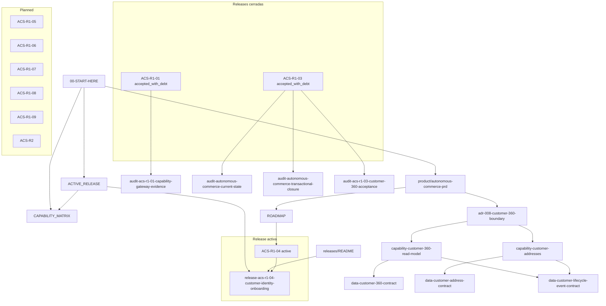

# Relationship Map

Este documento es un indice visual, no una fuente de verdad nueva.

## Vista general

## Relaciones principales

### Producto general

- `docs/ACTIVE_RELEASE.md` fija el trabajo activo.
- `docs/ROADMAP.md` fija la secuencia.
- `docs/CAPABILITY_MATRIX.md` fija el estado tecnico real.
- `docs/releases/README.md` indexa releases y estados.

### ACS-R1-01 y ACS-R1-03

- `ACS-R1-01` queda como release cerrada con deuda de hardening.
- `ACS-R1-03` queda como release cerrada con deuda de acceptance.
- Sus auditorias historicas son evidencia, no fuente normativa.

### ACS-R1-04

- `docs/releases/ACS-R1-04-customer-identity-onboarding.md` es la release activa.
- `docs/ACTIVE_RELEASE.md` es el tablero operativo de esa release.
- `resolve_customer` y `link_external_identity` pertenecen a la franja de identity onboarding.

### ADR, capabilities y contratos

- `docs/architecture/adr/ADR-008-customer-360-boundary.md` gobierna la frontera de Customer 360.
- `docs/capabilities/customer-360-read-model.md` y `docs/capabilities/customer-addresses.md` describen capabilities de lectura.
- `docs/data/customer-360-contract.md`, `docs/data/customer-address-contract.md` y `docs/data/customer-lifecycle-event-contract.md` fijan los contratos de datos.

## Regla de uso

- Si una relacion no aparece aqui, la fuente canonica sigue siendo el documento original con `doc_id` estable.
