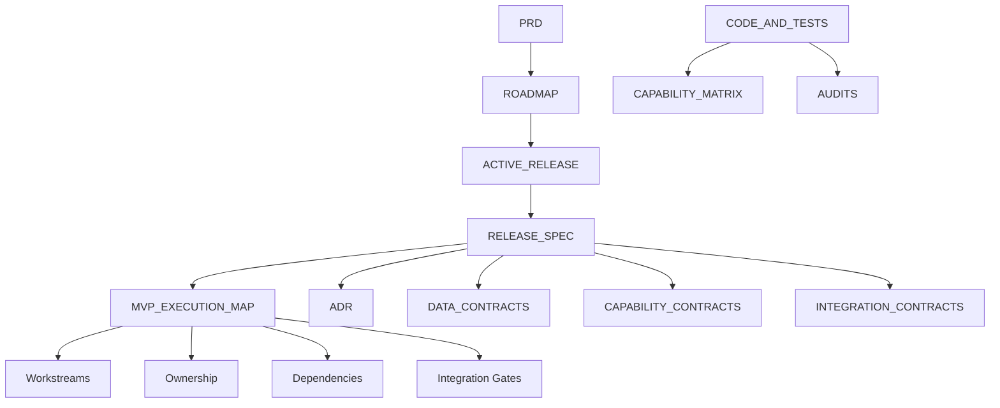

# Relationship Map

Este documento es un indice visual, no una fuente de verdad nueva.

## Vista general

## Relaciones principales

- `docs/product/autonomous-commerce-prd.md` define producto, MVP y limites.
- `docs/ROADMAP.md` define la secuencia de releases ACS.
- `docs/ACTIVE_RELEASE.md` identifica la release y tarea activas.
- `docs/releases/ACS-R1-04-customer-identity-onboarding.md` define alcance, tareas y Definition of Done de la release activa.
- `docs/product/MVP_EXECUTION_MAP.md` define workstreams, ownership, dependencias y paralelizacion.
- `docs/architecture/adr/*.md` define decisiones arquitectonicas obligatorias.
- `docs/data/*.md`, `docs/capabilities/*.md` y `docs/integrations/*.md` definen datos, capacidades y transporte.
- `docs/CAPABILITY_MATRIX.md` representa el estado tecnico real.
- `docs/audits/*.md` conserva evidencia historica.

## Reglas explicitas

- PRD no define tareas.
- ROADMAP no define contratos.
- MVP_EXECUTION_MAP no define prioridad temporal.
- ACTIVE_RELEASE no duplica la release spec.
- ADR no define prioridad.
- Contracts no definen roadmap.
- Capability Matrix no define futuro.
- Audits no definen presente.
- Workstreams no reemplazan releases.
- P1/P2/P3 no gobiernan ejecucion.

## Regla de uso

- Si una relacion no aparece aqui, la fuente canonica sigue siendo el documento original con `doc_id` estable.
