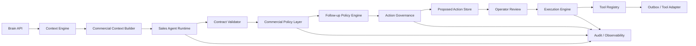
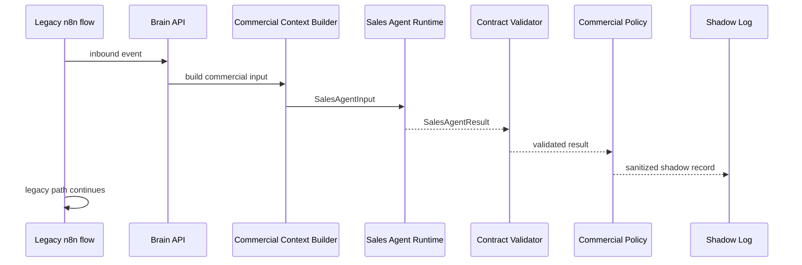
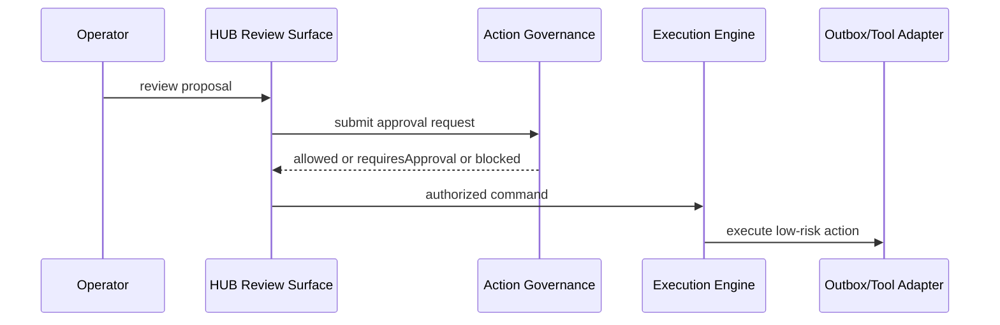
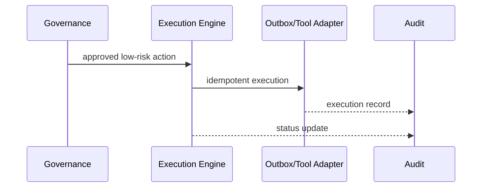

# AI SDR Implementation Blueprint

Este documento fija el tramo comercial del backend IA para P1K. No introduce runtime, prompts, endpoints ni writes.

P1K is already accepted and closed. The `P1K-*` markers in this document are historical and retained for traceability only.

## 1. Objetivo

Construir una capa deterministica que convierta el contexto de Brain + inbound en un `SalesAgentInput` seguro, estable y serializable.

La meta inmediata no es razonar ni responder, sino preparar un paquete comercial limpio para el futuro `Sales Agent Runtime`.

## 2. Estado actual

Ya existe:

- `Brain Context Engine`
- `Customer Candidate` de solo lectura bajo `customer_context.customer_candidate`
- contratos de Lead, Opportunity, Follow-up, Sales Agent y Operator Copilot en la capa de diseño
- resolución previa de contexto y normalizacion inbound

Todavia no existe:

- runtime de Sales Agent
- prompt comercial
- validator de output comercial
- persistencia comercial de Lead u Opportunity

## 3. P1K-007A

`P1K-007A` implementa `buildCommercialContext(input)` como adaptador puro.

Responsabilidades:

- leer Brain Context existente
- leer el inbound actual
- extraer referencias comerciales explicitas
- sanitizar payloads sensibles
- limitar historial reciente
- clasificar completitud sin inferir intencion de alto nivel
- devolver `SalesAgentInput` JSON serializable

Fuera de alcance:

- LLM
- tools
- DB
- prompts
- endpoints
- n8n
- outbox
- UI

## 4. Firma

```ts
buildCommercialContext(input: CommercialContextBuilderInput): CommercialContextBuilderResult
```

### Input

- `brainContext`
- `inboundMessage`
- `requestedMode`
- `currentTime`
- `timezone`
- `availableCapabilities`
- `policyContext?`
- `metadata?`

### Output

- `success`
- `insufficient_context`
- `invalid_input`

Cada salida expone:

- `salesAgentInput`
- `warnings`
- `sourceSummary`
- `completeness`
- `metadata`

## 5. Mapping

El builder extrae solo señales explicitamente observables.

### Identidad

- `customerCandidate`
- `conversationCaseId`
- `waId`
- `email`
- `phone`
- `idCustomer`
- `idOrder`
- `invoiceNumber`
- `contactId`

### Mensajeria

- `latest inbound message`
- `latest outbound message`
- `recent messages`
- `channel`
- `platform`
- `timestamps` relevantes

### Caso / operacion

- `department`
- `case status`
- `human ownership`
- `AI blocked`
- `manual reply`

### Comercial

- `commercial intent legacy`
- `order context`
- `product/service context`

### Señales estructurales permitidas

- `customer_message_present`
- `customer_candidate_available`
- `customer_reference_available`
- `order_reference_available`
- `product_service_context_available`
- `conversation_history_available`
- `human_owner_active`
- `ai_blocked`
- `manual_reply_active`
- `commercial_entity_available`

No se generan senales tipo:

- `high_intent`
- `objection_price`
- `readiness`
- `product_fit`

Esas corresponden al Sales Agent.

## 6. Lead y Opportunity

Durante esta fase:

- `lead` queda `undefined`
- `opportunity` queda `undefined`
- `missing_commercial_entity` se documenta como esperado

Esto evita convertir Case o Conversation en objetos comerciales persistentes antes de tiempo.

## 7. Completeness

La clasificacion usa cuatro niveles:

- `complete`
- `partial`
- `minimal`
- `insufficient`

Reglas base:

- sin mensaje customer relevante, el resultado debe caer en `insufficient`
- con mensaje pero sin contexto adicional, el resultado puede quedar en `minimal`
- con referencias, historial y candidato, puede subir a `partial` o `complete`

## 8. Warnings estables

El builder solo usa warnings estables:

- `missing_latest_customer_message`
- `missing_customer_reference`
- `missing_conversation_history`
- `missing_channel`
- `missing_commercial_entity`
- `stale_context`
- `identity_conflict`
- `ai_blocked`
- `human_owner_active`
- `unsupported_context_shape`
- `sanitization_applied`

## 9. Sanitizacion

No se expone:

- payload webhook crudo
- headers
- tokens
- credenciales
- objetos circulares
- BigInt crudo

El builder devuelve solo una copia segura y serializable.

## 10. Integracion futura

La integracion prevista, aun no implementada, es:

```text
processInbound
  -> resolveContext
  -> buildCommercialContext
  -> runSalesAgentDryRun
      -> provider
      -> rawOutput (unknown)
      -> validateSalesAgentOutput
  -> evaluateCommercialPolicy
  -> commercial evaluation
  -> shadow observation
  -> flujo productivo actual continúa sin cambios
```

`validateSalesAgentOutput` trata el output del modelo como `unknown`, aplica fail-closed y devuelve solo `valid`, `invalid` o `failed_safe`.
`evaluateCommercialPolicy` aplica la gobernanza deterministica posterior al validator.

Nada avanza hacia Policy, Governance o efectos operativos si la salida no pasa validacion estructural.
El shadow observa y registra, pero no controla la respuesta enviada ni introduce side effects.

Por ahora, el builder vive como pieza independiente para reducir riesgo y mantener la preview actual intacta.

## 11. Estado P1K

Estado actual del tramo comercial:

- `P1K-007A` DONE
- `P1K-007B` DONE
- `P1K-007C` DONE
- `P1K-007D` DONE
- `P1K-007E` DONE
- `P1K-007F` DONE
- `P1K-008A` DONE
- `P1K-009` DONE
- `P1K-010` DONE

`P1K-007A` implementa `buildCommercialContext(...)` como adaptador puro.
`P1K-007B` implementa `validateSalesAgentOutput(...)` como boundary fail-closed para output desconocido.
`P1K-007C` implementa `runSalesAgentDryRun(...)` con provider inyectable, timeout y observabilidad.
`P1K-007D` implementa la `Commercial Policy` deterministica posterior al validator.
`P1K-007F` implementa la evaluación comercial visible, offline y sin activar automatización productiva.
`P1K-008A` implementa la superficie read-only de review dentro de `/cases/[id]`, con DTO sanitizado, side effects visibles en cero y formulario humano local efimero.
`P1K-011A` define el contrato de lifecycle entre decision, proposed action, operator review y future execution command, sin persistencia ni ejecucion.
`P1K-011B` define el motor puro de follow-up planning en dry-run, sin persistencia ni ejecucion.
`P1K-012B` expone la cola de acciones en una superficie read-only de operador dentro de `/cases/[id]`, sin ejecutar nada.
`P1K-012E-A` define el decision engine puro de scheduling para follow-up y separa la reprogramacion de la proposal original.
`P1K-012E-B` define el contract de mutacion pura para cancel, expire, block, replan y replacement sobre resultados ya evaluados por `P1K-012E-A`.

## 12. P1K-009 Operational Loop

`P1K-009` agrega memoria comercial durable, reduccion deterministica de estado, seleccion de una unica proxima accion y persistencia transaccional opcional.

La continuacion del flujo legacy sigue activa y no hay outbound, tools ni follow-up automatico.

La base de lectura y persistencia del loop queda documentada en `docs/product/ai-sdr-operational-loop.md` y hoy usa `crm_opportunities` y `crm_agent_decisions`.

Siguiente milestone despues de P1K-010:

`P1K-011A` - `Approval/Action Lifecycle Contract` - DONE
`P1K-011B` - `Follow-up Planning Engine Dry Run` - DONE
`P1K-012A` - `Durable Agent Action Queue Schema` - DONE
`P1K-012B` - `Action Queue UI Preview / Operator Queue Surface` - DONE
`P1K-012C` - `Whitelisted Autonomous Reply Sandbox Contract` - NEXT
`P1K-012D-A` - `Storage-Agnostic Execution Gate Contract` - NEXT
`P1K-012D-B` - `Persistence Architecture Decision` - DONE
`P1K-012D-C` - `PostgreSQL/Supabase Repository Adapters` - NEXT
`P1K-012B-UI2` - `Chat-first Case Detail + AI SDR Copilot Layout` - DONE

## 13. Runtime y policy

La secuencia contractual actual es:

```text
processInbound
  -> resolveContext
  -> buildCommercialContext
  -> runSalesAgentDryRun
      -> provider
      -> rawOutput (unknown)
      -> validateSalesAgentOutput
  -> evaluateCommercialPolicy
  -> commercial evaluation
  -> shadow observation
  -> flujo productivo actual continúa sin cambios
```

`runSalesAgentDryRun` no ejecuta tools ni aplica policy.
`evaluateCommercialPolicy` no valida estructura, no ejecuta nada y solo gobierna si la propuesta comercial queda permitida, restringida, revisable o bloqueada.
`commercial evaluation` agrega trazabilidad offline y readiness sobre la salida ya observada, sin introducir side effects ni cambiar el flujo inbound.
`processInbound` incorpora el vertical comercial en modo shadow, sin side effects y sin alterar la respuesta actual del cliente.

## 13. P1K-010 Controlled Operator Pilot Shell

`P1K-010` agrega una superficie operacional compacta en `/cases/[id]` para revisar la siguiente accion propuesta por el AI SDR sin ejecutar nada.

La superficie:

- lee el resultado operativo persistido cuando existe;
- degrada a observacion shadow o `not_found` cuando el resultado no esta disponible;
- muestra estado comercial, etapa, resumen, informacion conocida, informacion faltante y proxima accion;
- expone controles piloto bloqueados por diseno;
- mantiene la vista tecnica como detalle secundario o colapsable;
- no escribe DB, no llama modelos y no ejecuta tools.

La salida se consume mediante un DTO de presentacion estable, `AiSdrOperatorPilotViewModel`, separado de los contratos internos.

Siguiente milestone despues de P1K-010:

`P1K-011A` - `Approval/Action Lifecycle Contract` - DONE
`P1K-011B` - `Follow-up Planning Engine Dry Run` - DONE
`P1K-012A` - `Durable Agent Action Queue Schema` - DONE
`P1K-012B` - `Action Queue UI Preview / Operator Queue Surface` - DONE
`P1K-012B-UI2` - `Chat-first Case Detail + AI SDR Copilot Layout` - DONE
`P1K-012C` - `Whitelisted Autonomous Reply Sandbox Contract` - NEXT
`P1K-012D-A` - `Storage-Agnostic Execution Gate Contract` - NEXT
`P1K-012D-B` - `Persistence Architecture Decision` - DONE
`P1K-012E-A` - `Follow-up Scheduling Decision Engine` - DONE
`P1K-012D-C` - `PostgreSQL/Supabase Repository Adapters` - NEXT

`P1K-012C` adds a sandbox-only eligibility preview for whitelisted identities. It does not execute replies, does not replace governance and does not imply production autonomy.
`P1K-012D-A` adds the storage-agnostic execution gate that persists canonical outbox intent, but it still does not call Meta or execute the worker.
`P1K-012F-A` adds the pure outbox worker contract that consumes that canonical outbox row later and keeps transport classification separate from the gate.
`P1K-012F-B` adds the WhatsApp transport adapter contract that translates the canonical message command into a provider request without exposing credentials or requiring a real Meta client.
`P1K-012D-B` closes the persistence decision by separating MariaDB legacy from the PostgreSQL/Supabase brain store.
`P1K-012E-A` adds the pure follow-up scheduling decision engine that sits after planning and before execution. It decides ready, wait, cancel, expire, replan, block or invalid without touching persistence.
`P1K-012E-B` adds the follow-up cancellation and replanning mutation contract that consumes the scheduling result and describes logical writes without executing them.
`P1K-012D-C` is the next technical milestone: repository adapters for that chosen storage split.

La vida util de `next_action_json` termina en la superficie read-only y en la decision operativa resumida. El planner de follow-up de P1K-011B puede sugerir seguimiento en modo dry-run, pero la cola durable de acciones queda en `crm_agent_actions` a partir de P1K-012A, una vez que la lectura y el permiso DB esten validados.

La vista tecnica read-only queda disponible para depuracion, pero la interaccion humana diaria vive en el shell operacional.
`P1K-012B-UI2` reorganiza la pagina hacia un layout de tres columnas: contexto a la izquierda, chat WhatsApp al centro y AI SDR Copilot a la derecha, con Action Queue y diagnostico tecnico colapsado dentro del copiloto.

## 14. P1K-008A Commercial Shadow Review Surface

La primera superficie visible de AI SDR vive dentro del detalle de caso `/cases/[id]` como un panel o pestaña `AI SDR`.

La UI solo consume un DTO de presentación sanitizado y read-only. Si no existe observación shadow, la superficie muestra `not_found` o `disabled` sin romper el caso ni la conversación.

La superficie muestra:

- propuesta del Sales Agent;
- resultado posterior a Commercial Policy;
- claims, acciones, tool requests y entidades propuestas;
- observabilidad, warnings, issues y trazabilidad;
- invariantes de side effects en cero;
- borrador local de evaluación humana sin persistencia.

No ejecuta tools, no llama modelos, no escribe DB, no muta Case y no controla Response Policy.

## 15. AI SDR Implementation Blueprint / Runtime Sequencing

## Purpose

Este documento convierte los contratos existentes del AI SDR en una secuencia de implementacion runtime segura, incremental, observable, reversible y fail-closed.

No define runtime funcional todavia. Define como implementarlo sin romper la preview actual, sin ejecutar acciones solo porque un LLM las propuso y sin mover la logica core a produccion antes de tiempo.

## Runtime target

La arquitectura objetivo es:



### Component boundaries

#### Commercial Context Builder

- adapta Brain Context a `SalesAgentInput`;
- no decide;
- no ejecuta;
- no muta entidades;
- no lee ni escribe la capa persistente comercial futura;
- solo prepara contexto comercial estructurado y sanitizado.

#### Sales Agent Runtime

- invoca el modelo;
- produce una respuesta estructurada;
- no ejecuta tools;
- no muta Lead, Opportunity, Customer, Follow-up ni audit;
- no define permisos;
- no decide hard blocks.

#### Contract Validator

- valida estructura de salida;
- rechaza valores fuera de contrato;
- limita tamaño de texto, arrays y metadata;
- sanitiza metadata;
- degrada a `failed_safe` si la respuesta no es confiable.

#### Commercial Policy Layer

- aplica reglas determinísticas;
- bloquea claims sensibles sin evidencia;
- corrige, elimina o rebaja acciones no permitidas;
- calcula approval requirement;
- no depende del modelo para hard blocks.

#### Follow-up Policy Engine

- evalua elegibilidad, supresiones, canal y urgencia;
- produce `FollowUpDecisionResult`;
- no envía;
- no agenda;
- no programa jobs reales en esta fase.

#### Action Governance

- decide `allowed`, `blocked` o `requiresApproval`;
- aplica hard blocks deterministas;
- conserva trazabilidad;
- no confia en el modelo para autorizar acciones.

#### Proposed Action Store

- puede ser primero read-only o in-memory;
- despues se convierte en read model persistente;
- guarda propuestas, aprobaciones y estados;
- no es el ejecutor.

#### Operator Review

- representa revision humana sobre propuestas y acciones;
- puede aprobar, rechazar o solicitar cambios;
- no ejecuta por si mismo.

#### Execution Engine

- recibe solo acciones autorizadas;
- aplica idempotencia;
- usa Tool Registry y Outbox / Tool Adapter;
- se conecta al execution gate storage-agnostic definido en P1K-012D-A;
- permanece deshabilitado al inicio.

#### Outbox / Tool Adapter

- ejecuta solo lo autorizado;
- traduce comandos internos a integraciones;
- no decide si la accion debe ocurrir.

#### Audit / Observability

- registra run ids, estados, errores, flags y versionado;
- no puede ser modificado por el Copilot ni por el LLM;
- conserva la historia de decisiones y ejecuciones.

## Risk levels

### Nivel 0

- analisis;
- clasificacion;
- explicacion;
- logging.

### Nivel 1

- recomendaciones;
- next best action;
- borradores;
- dry-run commands.

### Nivel 2

- tareas internas;
- revision humana;
- cambios reversibles.

### Nivel 3

- mensajes WhatsApp aprobados manualmente;
- quote drafts aprobados;
- follow-up programado bajo supervision.

### Nivel 4

- acciones de bajo riesgo automaticas bajo policy.

### Nivel 5

- autonomia avanzada futura.

El MVP debe comenzar en niveles 0 a 2.

## Implementation phases

### P1K-006A - Commercial Runtime Types and Boundaries

Objetivo:

- fijar tipos de runtime, correlation ids y boundaries entre capas.

Entrega esperada:

- contratos de runtime;
- mapeo de campos;
- metadata y versionado;
- limites de scope y sanitizacion.

### P1K-006B - Commercial Context Builder

Objetivo:

- transformar Brain Context en `SalesAgentInput` de forma deterministica.

Entrega esperada:

- adapter estructurado;
- sanitizacion;
- correlation ids;
- snapshot de flags.

### P1K-006C - Sales Agent Runtime Dry-Run

Objetivo:

- correr el Sales Agent en paralelo sin controlar Response Policy.

Entrega esperada:

- run dry-run;
- resultado estructurado;
- logs sanitizados;
- sin outbound ni mutacion.

### P1K-006D - Sales Agent Contract Validation

Objetivo:

- validar que la salida del modelo cumpla el contrato.

Entrega esperada:

- validator;
- limites de tamanos;
- manejo seguro de malformed outputs;
- fail-safe.

### P1K-006E - Commercial Policy Enforcement

Objetivo:

- aplicar hard blocks, evidence rules y approval requirement.

Entrega esperada:

- policy evaluator;
- blocked claims;
- blocked actions;
- audit de reglas aplicadas.

### P1K-006F - Follow-up Policy Evaluator

Objetivo:

- producir follow-up decision en modo dry-run.

Entrega esperada:

- eligibility;
- suppression;
- next best action;
- no scheduler.

### P1K-006G - Proposed Actions and Approval Read Model

Objetivo:

- representar propuestas, decisiones pendientes y approvals futuras.

Entrega esperada:

- read model de proposed actions;
- estados;
- referencias de evidencia y policy.

### P1K-006H - Operator Copilot Read-Only Runtime

Objetivo:

- exponer vista de supervision y explicacion sobre resultados ya validados.

Entrega esperada:

- summaries;
- explanations;
- review items;
- proposed commands dry-run.

### P1K-006I - HUB Review Surface

Objetivo:

- dar al operador una superficie para aprobar, rechazar o editar propuestas.

Entrega esperada:

- review queue;
- pending approvals;
- audit trail de decisiones humanas.

### P1K-006J - Controlled Commercial Execution

Objetivo:

- ejecutar acciones de bajo riesgo con approval y audit.

Entrega esperada:

- execution gate;
- idempotencia;
- rollback;
- outbox worker contract;
- outbox / tool adapter.

### P1K-006K - Opportunity Persistence

Objetivo:

- persistir Opportunity antes de automatizar ejecucion multietapa.

Entrega esperada:

- read model durable;
- invariantes;
- ownership;
- transiciones;
- estrategia de migracion.

### P1K-006L - Lead Persistence

Objetivo:

- persistir Lead como entidad comercial durable cuando ya exista el modelo de opportunity y approvals.

Entrega esperada:

- lead durable;
- relaciones con identity auxiliar;
- compatibilidad con customer candidate.

## Recommended ordering

El orden mas seguro recomendado es:

1. `P1K-006A` Commercial Runtime Types and Boundaries
2. `P1K-006B` Commercial Context Builder
3. `P1K-006C` Sales Agent Runtime Dry-Run
4. `P1K-006D` Sales Agent Contract Validation
5. `P1K-006E` Commercial Policy Enforcement
6. `P1K-006F` Follow-up Policy Evaluator
7. `P1K-006G` Proposed Actions and Approval Read Model
8. `P1K-006H` Operator Copilot Read-Only Runtime
9. `P1K-006K` Opportunity Persistence
10. `P1K-006I` HUB Review Surface
11. `P1K-006J` Controlled Commercial Execution
12. `P1K-006L` Lead Persistence

### Why Opportunity Persistence goes before Controlled Execution

- sin Opportunity persistente no existe memoria comercial durable para decisiones multietapa;
- pero persistencia prematura tambien puede congelar un modelo incorrecto;
- por eso, el recommended path es primero validar el flujo read-only, luego fijar proposed actions y despues persistir Opportunity antes de habilitar ejecucion controlada;
- Lead persistence puede ir despues, porque Opportunity es el centro operativo comercial del MVP.

## First vertical slice

### Slice 1: inbound commercial shadow

Flow:

message inbound
→ Brain Context
→ Commercial Context Builder
→ Sales Agent dry-run
→ Contract Validator
→ Commercial Policy
→ shadow/debug response
→ no send
→ no mutation
→ no follow-up execution

Inputs:

- `waId`
- inbound text
- `conversationCaseId`
- `messageId`
- contextual identity auxiliary data if available

Outputs:

- sanitized `SalesAgentResult`
- policy assessment
- warnings
- optional `commercial_analysis` in debug/shadow response

Feature flags:

- `BRAIN_COMMERCIAL_CONTEXT_ENABLED`
- `BRAIN_SALES_AGENT_ENABLED`
- `BRAIN_SALES_AGENT_DRY_RUN`
- `BRAIN_COMMERCIAL_POLICY_ENABLED`

All must remain false by default.

Logs:

- correlation id,
- run ids,
- contract version,
- policy version,
- feature flags snapshot,
- latency,
- warnings,
- errors,
- dry-run marker.

Tests:

- contract tests,
- malformed output tests,
- prompt injection tests,
- stale context tests,
- identity conflict tests,
- hard-block bypass tests,
- timeout tests.

Approval criteria:

- 100% outputs validated or fail-safe;
- 0 sent messages;
- 0 mutations;
- 0 hard-block bypasses;
- full observability;
- acceptable latency and cost;
- human review of fixtures.

## Second vertical slice

### Slice 2: dry-run recommendation to follow-up

Flow:

Sales Agent dry-run
→ next best action
→ Follow-up Policy dry-run
→ Governance
→ proposed action visible to operator
→ no execution

Purpose:

- validate that commercial recommendation and follow-up can coexist without sending anything.

## Third vertical slice

### Slice 3: operator review of a proposal

Flow:

Operator views proposal
→ approves or rejects
→ command is recorded as dry-run audited proposal
→ still no send

Purpose:

- validate human approval flow and audit visibility before execution is enabled.

## Fourth vertical slice

### Slice 4: controlled internal task execution

Flow:

human approval
→ execution controller
→ internal task creation only
→ audit
→ no WhatsApp outbound

Why internal task first:

- reversible,
- low risk,
- does not commit customer-facing messaging,
- proves the approval and execution path without risking outbound damage.

## Shadow mode



Shadow mode rules:

- legacy flow keeps working;
- Sales Agent runs in parallel;
- no outbound;
- no opportunity mutation;
- no follow-up execution;
- no double task creation;
- sanitized comparison only.

Exit conditions:

- stable contracts,
- valid outputs,
- no hard-block bypass,
- acceptable latency,
- acceptable cost,
- no incidents,
- human review favorable.

## Approval mode



Rules:

- approval must be human and authorized;
- hard blocks remain blocked;
- a command proposal is not an execution;
- execution only happens after governance.

## Controlled execution mode



Execution requirements:

- idempotency,
- audit,
- rollback marking,
- tool allowlist,
- feature flag gate,
- failure closed.

## Feature flags

Proposed flags:

- `BRAIN_COMMERCIAL_CONTEXT_ENABLED`
- `BRAIN_SALES_AGENT_ENABLED`
- `BRAIN_SALES_AGENT_DRY_RUN`
- `BRAIN_COMMERCIAL_POLICY_ENABLED`
- `BRAIN_FOLLOWUP_POLICY_ENABLED`
- `BRAIN_COMMERCIAL_PROPOSALS_ENABLED`
- `BRAIN_OPERATOR_COPILOT_ENABLED`
- `BRAIN_COMMERCIAL_APPROVALS_ENABLED`
- `BRAIN_COMMERCIAL_EXECUTION_ENABLED`
- `BRAIN_COMMERCIAL_WHATSAPP_SEND_ENABLED`
- `BRAIN_OPPORTUNITY_PERSISTENCE_ENABLED`
- `BRAIN_LEAD_PERSISTENCE_ENABLED`

Default:

- all false by default.

Dependency notes:

- Sales Agent runtime requires Commercial Context Builder and Contract Validator.
- Commercial Policy requires validated SalesAgentResult.
- Follow-up Policy can run dry-run without scheduler.
- Operator Copilot requires validated outputs and sanitized context only.
- Execution requires governance, approvals, idempotency and audit.
- WhatsApp send must remain disabled until controlled execution is proven.

## Enforcement points

Mandatory enforcement points:

- Sales Agent input boundary,
- Sales Agent output boundary,
- sensitive claims,
- tool requests,
- proposed actions,
- entity proposals,
- follow-up eligibility,
- approvals,
- execution,
- audit,
- data access,
- PII sanitization.

The LLM never decides permissions, lifts hard blocks, approves its own actions, executes tools, marks execution complete, invents evidence, modifies logs, determines definitive identity or overwrites policy.

## Adapters to introduce later

- `SalesAgentInputAdapter`
- `SalesAgentOutputValidator`
- `CommercialPolicyEvaluator`
- `FollowUpInputAdapter`
- `FollowUpPolicyEvaluator`
- `GovernanceAdapter`
- `OperatorCopilotInputAdapter`
- `ProposedActionAdapter`
- `CommercialExecutionAdapter`

## Recommended folder structure

```text
lib/brain/commercial/
  context/
  sales-agent/
  policy/
  follow-up/
  governance/
  proposals/
  copilot/
  execution/
  observability/
```

No file moves are required in this phase.

## Observability by run

Minimum fields:

- `correlationId`
- `processInboundRunId`
- `contextResolveRunId`
- `salesAgentRunId`
- `followUpRunId`
- `governanceDecisionId`
- `proposedActionIds`
- `approvalReference`
- `executionReference`
- `status`
- `durationMs`
- `model`
- `tokens`
- `estimatedCost`
- `warnings`
- `errors`
- `dryRun`
- `featureFlagsSnapshot`
- `contractVersion`
- `policyVersion`

## Observable events

- `commercial_context_built`
- `sales_agent_started`
- `sales_agent_completed`
- `sales_agent_invalid_output`
- `commercial_policy_applied`
- `followup_evaluated`
- `proposed_action_created`
- `proposed_action_blocked`
- `approval_requested`
- `approval_recorded`
- `command_proposed`
- `execution_requested`
- `execution_completed`
- `execution_failed`
- `rollback_triggered`

## MVP metrics

- `sales_agent_valid_output_rate`
- `sales_agent_failure_rate`
- `average_agent_latency`
- `average_agent_cost`
- `sensitive_claim_block_rate`
- `proposed_action_rate`
- `human_review_rate`
- `approval_rate`
- `rejection_rate`
- `followup_eligibility_rate`
- `commercial_no_action_rate`
- `execution_error_rate`
- `operator_override_rate`

## Quality gates

Before moving from read-only dry-run to visible proposals:

- 100% of outputs are valid or fail-safe;
- 0 sensitive claims without evidence accepted;
- 0 unexpected mutations;
- 0 executions;
- logs complete;
- latency measured;
- cost measured;
- curated fixture set reviewed;
- shadow comparison acceptable.

## Test strategy

- contract tests,
- deterministic policy tests,
- fixture-based agent tests,
- malformed output tests,
- prompt injection tests,
- missing evidence tests,
- hard-block bypass tests,
- stale context tests,
- identity conflict tests,
- duplicate action tests,
- approval bypass tests,
- dry-run invariants,
- timeout tests,
- provider failure tests.

## Fixture categories

- pregunta de producto general,
- solicitud de precio,
- solicitud de stock,
- cotizacion,
- cliente de alta intencion,
- objecion de precio,
- rechazo explicito,
- solicitud humana,
- pedido existente,
- mensaje ambiguo,
- identity conflict,
- oportunidad terminal,
- follow-up no elegible,
- follow-up elegible,
- tool unavailable,
- malformed agent output.

## Fail-safe behavior

### Sales Agent error

- no responder automaticamente;
- no emitir claim sensible;
- no mutar;
- return `failed_safe`;
- preserve context and logs;
- optionally propose human review.

### Policy or Governance error

- block the action;
- do not execute;
- log the error;
- escalate to operator when appropriate.

### Copilot error

- no impact on original decision;
- no execution;
- return safe explanation or review guidance.

## Rollout and rollback

Rollout path:

1. local fixtures,
2. test environment,
3. shadow with internal traffic,
4. shadow with limited real traffic,
5. operator-only visibility,
6. manual review,
7. internal tasks,
8. approved outbound,
9. limited automation.

Rollback path:

- disable feature flag,
- return to legacy flow,
- ignore pending proposals,
- cancel not-yet-started execution,
- preserve logs and audit,
- mark runs as rolled_back.

## Open decisions

Classify these as `requires_validation` until data exists:

- sales agent provider/model,
- opportunity persistence shape,
- proposed action storage,
- approval storage,
- persistent audit storage,
- max accepted latency,
- max accepted cost per conversation,
- number of retries,
- exact HUB integration point,
- exact coexistence with n8n.

Classify these as `provisional`:

- dry-run first,
- human approval before sensitive actions,
- WhatsApp remains priority channel,
- Opportunity is the commercial center,
- Customer Candidate remains auxiliary context.

Classify these as `decided`:

- no action is executed just because an LLM proposed it,
- all hard blocks are deterministic,
- all sensitive claims need evidence,
- runtime starts fail-closed.

## Relationship with processInbound

Future recommended flow:

`processInbound`
→ `resolveContext`
→ `buildCommercialContext`
→ `runSalesAgent` in dry-run
→ `validate`
→ `apply policy`
→ optional `commercial_analysis` in debug/shadow response

The public `processInbound` contract does not change in this phase.

## Relationship with n8n

- n8n remains the legacy integrator during transition;
- Brain can run in parallel for comparison;
- no double send;
- no double task creation;
- correlation ids must support side-by-side comparison;
- migration should happen by capability, not by a hard cut.

## Decision about Opportunity persistence

Recommendation:

- do not start controlled execution without either a durable Opportunity read model or a strongly defined proposed-opportunity snapshot;
- do not force final persistence before the read-only and proposal surfaces are validated;
- therefore, Opportunity persistence should be implemented before controlled execution beyond internal tasks, but after the read-only vertical slice proves the flow.

## Decision about Lead persistence

Lead persistence should come after Opportunity persistence or in the same tranche only if the commercial invariants are already stable.

## Deliverables of P1K-006

- blueprint tecnico,
- secuencia runtime,
- matriz de componentes,
- matriz de flags,
- matriz de riesgos,
- vertical slices,
- test strategy,
- activation gates,
- rollback plan,
- backlog tecnico siguiente.

## Final rule

Ninguna accion comercial real debe ejecutarse solo porque un LLM la propuso.

## P1K-012G

`P1K-012G` is the autonomous commercial loop orchestrator. It composes the existing contracts in memory, but it does not add live persistence, live transport or scheduler runtime.

## P1K-012H

`P1K-012H` adds the end-to-end scenario simulator on top of the orchestrator. It runs synthetic multi-step scenarios, captures safe snapshots and validates expectations and invariants without introducing production writes.
