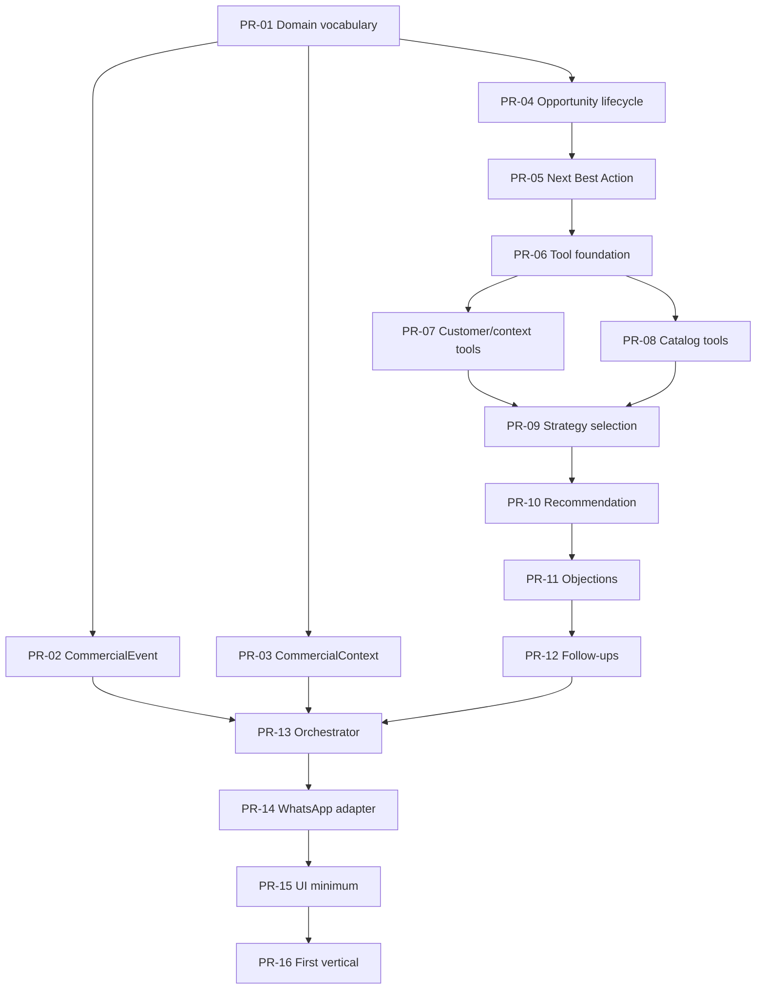

# Autonomous Commerce Implementation Backlog

This backlog converts the PRD and the current repository state into a sequence of independent PRs that can carry the product to the first functional vertical.

## 1. Consistency check

### Contradictions found

1. Stage vocabulary is split between target PRD states and historical shared contracts.
   - PRD target: `discovery`, `qualification`, `recommendation`, `objection_handling`, `purchase_intent`, `checkout_support`, `follow_up`, `won`, `lost`, `handoff`.
   - Legacy shared contracts in `lib/brain/commercial/types.ts` and `lib/brain/commercial/constants.ts`: `discovery`, `qualification`, `solution_fit`, `quotation`, `negotiation`, `closing`, `post_sale_handoff`.
   - Resolution: document both as legacy vs target; do not collapse them silently.

2. Tool naming is inconsistent between PRD and implemented code.
   - PRD lists conceptual tools like `queue_whatsapp_message`, `create_escalation`, and `request_human_handoff`.
   - Current repo implementation uses `queueCustomerMessageRecord` / `queueCustomerMessage` and `requestHumanHandoffRecord` / `requestHumanHandoff`.
   - Resolution: documented implementation aliases are accepted for now; the canonical product tool names live in the tool catalog, not the helper function names.

3. `request_human_handoff` was duplicated in the first tool catalog draft.
   - Resolution: removed the duplicate and kept a single canonical row.

4. `queue_outbound_message` in the first docs was not aligned with the PRD tool naming or the current code path.
   - Resolution: standardized the documented tool to `queue_customer_message`, with the current implementation alias noted.

5. The boundary between `crm_agent_decisions` and `ai_agent_decision` is fixed.
   - PRD and ADR-001 place the durable commercial decision in CRM and the technical execution evidence in `ai_*`.
   - Resolution: accepted and frozen in ADR-001.

6. Action ownership and next-action projection are fixed.
   - `crm_agent_actions` is the durable action source.
   - `crm_opportunities.next_action_*` is a projection.
   - Resolution: accepted and frozen in ADR-003 and ADR-004.

7. Strategy selection is AI-led, not hardcoded deterministic.
   - Deterministic rules remain available as safe fallback and validation.
   - Resolution: align PR-09 with AI planning plus Brain validation.

8. Recommendation must stay inside real eligible candidates.
   - Product selection can only happen from a validated candidate set returned by `CatalogService` and hard filters.
   - Resolution: align PR-10 with candidate-set selection and explanation.

9. The meaning of `productivo` is still easy to overstate.
   - Native slice is real and tested.
   - The full product is not yet complete.
   - Resolution: backlog must use binary acceptance, not "looks wired".

### Ambiguities

1. How to migrate the legacy `crm_opportunities.human_owner_active` field away without breaking existing reads.
2. Whether `CommercialEvent`, `ToolRequest`, and `ToolResult` should be introduced as thin documented aliases over existing runtime shapes before PR-02, or remain documentation-only until their runtime wrappers are built.
3. Whether `AIPlan` and `CapabilityEvaluation` should map cleanly onto existing strategy/policy types during implementation or require new type wrappers.

### Duplications

1. Human handoff state is represented in conversation, opportunity, action, and decision layers.
2. Outbound intent exists in consultative outputs, outbox rows, and timeline messages.
3. Opportunity next action appears both in opportunity state and action rows.
4. Current docs contain both legacy and target stage vocabularies.

### Decisions still pending

1. Final authoritative stage vocabulary migration path.
2. Whether the runtime will expose thin wrappers for `CommercialEvent`, `ToolRequest`, and `ToolResult` in PR-02 or keep those as documentation-only contracts until the implementation PRs land.
3. Whether `AIPlan` and `CapabilityEvaluation` should reuse existing strategy/policy shapes or become new runtime wrappers.

### Docs corrected or created because the resolution was evident

- `docs/product/autonomous-commerce-tool-catalog.md`
- `docs/product/autonomous-commerce-first-vertical.md`
- `docs/product/autonomous-commerce-state-model.md`
- `docs/architecture/adr/ADR-001-commercial-vs-ai-decisions.md`
- `docs/architecture/adr/ADR-002-ai-runtime-observability-boundary.md`
- `docs/architecture/adr/ADR-003-commercial-action-source-of-truth.md`
- `docs/architecture/adr/ADR-004-next-best-action-ownership.md`
- `docs/architecture/adr/ADR-005-catalog-boundary.md`
- `docs/architecture/adr/ADR-006-autonomous-planning-and-capability-governance.md`
- `docs/architecture/adr/ADR-007-failure-escalation-and-outcomes.md`

## 2. Frozen contracts

These contracts should be frozen before the implementation sequence starts. Some already exist partially in code; some exist only as neighboring types; some are still missing.
The ownership boundaries behind them are now fixed by ADR-001 through ADR-007.
Every frozen contract carries `contractName` and `schemaVersion`; schema versions follow semver, with compatible changes as minor and breaking changes as major.

### 2.1 `CommercialEvent`

- Responsibility: normalize inbound, outbound, status, timer, and internal business events into one commercial event envelope.
- Owner: command runtime.
- Minimum fields:
  - `id`
  - `eventType`
  - `source`
  - `correlationId`
  - `occurredAt`
  - `customerRef`
  - `conversationRef`
  - `opportunityRef`
  - `payload`
- Optional fields:
  - `providerMessageId`
  - `channel`
  - `metadata`
  - `dedupeKey`
- Invariants:
  - one event, one correlation id;
  - no raw provider payload as source of truth;
  - idempotent by source + external id when applicable.
- Produced by: webhook adapters, worker status handlers, timers, internal commands.
- Consumed by: context builder, opportunity lifecycle, cycle orchestrator, audit.
- Persistence: event log table or append-only log model not yet explicit in code.
- Version: `1.0.0`.
- Current code state: missing as an explicit contract; spread across inbound processing and shadow/event runtimes.

### 2.2 `CommercialContext`

- Responsibility: provide the normalized commercial snapshot used by decisioning.
- Owner: AI planning layer.
- Minimum fields:
  - `customer`
  - `conversation`
  - `recentMessages`
  - `opportunity`
  - `needProfile`
  - `actions`
  - `signals`
  - `availableCapabilities`
- Optional fields:
  - `policyContext`
  - `metadata`
  - `knowledgeContext`
  - `customerCandidate`
- Invariants:
  - no unsafe raw payload;
  - serializable;
  - no legacy fallback assumptions inside the contract.
- Produced by: commercial context builder.
- Consumed by: consultative engine, policy, orchestrator, review surfaces.
- Persistence: not the source of truth itself; read model from multiple tables.
- Version: `1.0.0` target contract; current code exists as `CommercialContextBuilderResult` / `SalesAgentInput` family.
- Current code state: partially implemented under `lib/brain/commercial/types.ts`, `lib/brain/commercial/context/*`, `lib/brain/commercial/sales-agent/*`.

### 2.3 `OpportunityState`

- Responsibility: durable commercial state for a single opportunity.
- Owner: commercial decision domain.
- Minimum fields:
  - `opportunityKey`
  - `status`
  - `stage`
  - `primaryIntent`
  - `currentSummary`
  - `nextActionType`
  - `nextActionDueAt`
  - `waitingFor`
  - `humanOwnerActive`
  - `aiBlocked`
  - `closedAt`
- Optional fields:
  - `productInterests`
  - `requirements`
  - `objections`
  - `signals`
  - `temperature`
  - `priority`
- Invariants:
  - one logical opportunity per key;
  - terminal states must be explicit;
  - no silent duplicate opportunities for the same commercial path.
- Produced by: consultative engine and opportunity commands.
- Consumed by: AI SDR, UI, follow-up, handoff, audit.
- Persistence: `crm_opportunities`.
- Version: `1.0.0` target contract; current code has a working model, but stage vocabulary is still partly historical.
- Current code state: implemented, but not fully frozen against the PRD target vocabulary.

### 2.4 `ConversationState`

- Responsibility: durable state of the message thread.
- Owner: conversation domain / command runtime.
- Minimum fields:
  - `customerId`
  - `channel`
  - `externalThreadId`
  - `status`
  - `aiEnabled`
  - `humanOwnerActive`
  - `lastInboundAt`
  - `lastOutboundAt`
- Optional fields:
  - `provider`
  - `ownerType`
  - `ownerId`
  - `lastMessageAt`
- Invariants:
  - one thread per customer/channel identity;
  - inbound must be persisted before agent execution;
  - human takeover must suppress automated response.
- Produced by: native inbound service and human takeover commands.
- Consumed by: UI, agent runtime, outbox worker, delivery status updates.
- Persistence: `conversation`.
- Version: `1.0.0`.
- Current code state: implemented.

### 2.5 `TurnObjective`

- Responsibility: the goal of a single commercial turn.
- Owner: AI planning layer.
- Minimum fields:
  - `type`
  - `rationale`
  - `confidence`
  - `requiresHuman`
  - `channel`
- Optional fields:
  - `missingInformation`
  - `recommendedQuestion`
  - `suggestedFollowUp`
- Invariants:
  - exactly one primary turn objective;
  - objective must be derivable from context and policy;
  - cannot invent state transitions.
- Produced by: consultative engine.
- Consumed by: opportunity lifecycle, response generation, action queue.
- Persistence: part of decision/action records, not yet a standalone table.
- Version: `1.0.0` target contract; current code is inferred from consultative output.
- Current code state: partially represented in `SalesConsultativeResult` and `SalesAgentDecision`.

### 2.6 `CommercialStrategy`

- Responsibility: describe how the turn should be handled commercially.
- Owner: AI planning layer.
- Minimum fields:
  - `name`
  - `purpose`
  - `preconditions`
  - `desiredOutcome`
  - `fallback`
  - `riskLevel`
- Optional fields:
  - `objectionTypes`
  - `requiredTools`
  - `approvalRequirement`
- Invariants:
  - one strategy per turn;
  - must match observed signals;
  - must not bypass policy.
- Produced by: strategy selector.
- Consumed by: recommendation, objection handling, follow-up planning.
- Persistence: not yet a dedicated table.
- Version: `1.0.0`.
- Current code state: exists as behavior, not as a frozen domain contract.

### 2.7 `NextBestAction`

- Responsibility: define the single next commercial action to take.
- Owner: commercial decision domain.
- Minimum fields:
  - `type`
  - `objective`
  - `rationaleSummary`
  - `channel`
  - `dueAt`
  - `requiredTools`
  - `preconditions`
  - `cancellationConditions`
  - `successCriteria`
  - `idempotencyKey`
  - `approvalRequirement`
- Optional fields:
  - `messageDraft`
  - `blockedReasons`
  - `followUpHint`
- Invariants:
  - one primary action only;
  - must be cancelable under policy;
  - must never imply direct send.
- Produced by: consultative engine.
- Consumed by: action queue, outbox, UI, follow-up.
- Persistence: `crm_agent_decisions.next_action_json` today; later also action rows.
- Version: `1.0.0` target contract; code currently uses consultative result fields and `next_action_json`.
- Current code state: partially implemented.

### 2.8 `ToolRequest`

- Responsibility: declare a tool call requested by the agent.
- Owner: capability gateway.
- Minimum fields:
  - `tool`
  - `status`
  - `reason`
  - `requiredInputs`
  - `optionalInputs`
  - `fallbackDecision`
- Optional fields:
  - `confidence`
  - `blocking`
  - `riskLevel`
  - `expectedEvidence`
- Invariants:
  - tool name must be from registry;
  - blocked tool calls must stay blocked;
  - no direct side effect from the request itself.
- Produced by: sales agent runtime.
- Consumed by: policy layer, tool executor, review surfaces.
- Persistence: current code has `SalesAgentToolRequest` and `BrainToolRequest`, but no single product contract.
- Version: `1.0.0`.
- Current code state: partially implemented under `lib/brain/tools/types.ts` and `lib/brain/commercial/sales-agent/validationTypes.ts`.

### 2.9 `ToolResult`

- Responsibility: record the outcome of a tool request.
- Owner: command runtime.
- Minimum fields:
  - `tool`
  - `status`
  - `startedAt`
  - `finishedAt`
  - `output`
  - `error`
  - `correlationId`
- Optional fields:
  - `retryable`
  - `latencyMs`
  - `warnings`
  - `providerRef`
- Invariants:
  - every executed tool must have a terminal result;
  - result must be auditable;
  - error must be explicit when failing closed.
- Produced by: tool executor.
- Consumed by: agent runtime, audit, orchestrator, UI.
- Persistence: `ai_tool_execution` today is closest, but not a product contract yet.
- Version: `1.0.0`.
- Current code state: absent as a formal contract.

### 2.10 `CRMCommand`

- Responsibility: represent a validated domain command.
- Owner: command runtime.
- Minimum fields:
  - `commandType`
  - `aggregateRef`
  - `correlationId`
  - `requestedBy`
  - `payload`
  - `requestedAt`
- Optional fields:
  - `idempotencyKey`
  - `policyDecision`
  - `sourceEventId`
- Invariants:
  - command is validated before execution;
  - command is idempotent or guarded by a dedupe key;
  - command never writes directly from the model layer.
- Produced by: orchestrator and validated UI actions.
- Consumed by: command handlers and repositories.
- Persistence: not yet an explicit command log.
- Version: `1.0.0`.
- Current code state: absent as a formal contract.

### 2.11 `ActionOutcome`

- Responsibility: capture observable outcomes related to an action.
- Owner: commercial action domain.
- Minimum fields:
  - `actionId`
  - `status`
  - `resultType`
  - `resultSummary`
  - `occurredAt`
- Optional fields:
  - `providerMessageId`
  - `errorCode`
  - `retryCount`
  - `nextActionId`
- Invariants:
  - an action can generate multiple outcomes over time;
  - each outcome must be auditable;
  - outcome must not be inferred from a UI state.
- Produced by: action executor, worker, manual operator completion, or provider callbacks.
- Consumed by: opportunity lifecycle, UI, audit, metrics.
- Persistence: spread across action rows, outbox rows, and conversation messages today.
- Version: `1.0.0`.
- Current code state: partial.

### 2.12 `CommercialCycleResult`

- Responsibility: summarize the complete autonomous cycle outcome.
- Owner: command runtime.
- Minimum fields:
  - `commercialEventId`
  - `context`
  - `strategy`
  - `turnObjective`
  - `nextBestAction`
  - `toolRequests`
  - `toolResults`
  - `actionOutcome`
  - `warnings`
- Optional fields:
  - `decisionId`
  - `opportunityId`
  - `conversationId`
  - `followUpPlan`
- Invariants:
  - every cycle must be traceable to one incoming event;
  - one cycle must not create multiple primary outcomes;
  - cycle result is a summary projection, not the truth layer.
- Produced by: commercial cycle orchestrator.
- Consumed by: UI, audit, reporting, follow-up.
- Persistence: currently split between multiple tables and traces.
- Version: `1.0.0`.
- Current code state: partial, mostly represented by consultative service and shadow orchestration.

### 2.13 `AIPlan`

- Responsibility: represent the wide commercial plan before a single action is accepted.
- Owner: AI planning layer.
- Minimum fields:
  - `planId`
  - `commercialCycleId`
  - `objective`
  - `strategy`
  - `primaryAction`
  - `alternativeActions`
  - `capabilities`
  - `expectedOutcomes`
  - `replanConditions`
  - `stopConditions`
- Optional fields:
  - `evidence`
  - `idempotencyKey`
  - `escalationTarget`
  - `reactivationHint`
- Invariants:
  - one primary action per accepted cycle;
  - a plan can exist without side effects;
  - plan is not the same as an accepted commercial decision.
- Produced by: AI planning layer.
- Consumed by: capability evaluation, policy, decisioning, orchestration.
- Persistence: not yet a dedicated product table.
- Version: `1.0.0`.
- Current code state: missing as an explicit contract.

### 2.14 `CapabilityEvaluation`

- Responsibility: record whether a proposed capability is available and under what constraints.
- Owner: capability gateway.
- Minimum fields:
  - `capabilityName`
  - `status`
  - `reason`
  - `policyResult`
  - `validatedAt`
- Optional fields:
  - `missingInformation`
  - `requiresApproval`
  - `blockedReasons`
  - `replanHint`
- Invariants:
  - unavailable capabilities must not be treated as available;
  - capability evaluation can block or replan without mutating CRM;
  - failed tool proposals do not become commercial decisions.
- Produced by: backend validation.
- Consumed by: planning, decisioning, UI, audit.
- Persistence: projected through runtime traces and audit, not a current dedicated table.
- Version: `1.0.0`.
- Current code state: partially represented by policy and validation types, not frozen as a standalone contract.

### 2.15 `AIProposal`

- Responsibility: capture one proposed commercial move before acceptance.
- Owner: AI planning layer.
- Minimum fields:
  - `contractName`
  - `schemaVersion`
  - `proposalId`
  - `planId`
  - `objective`
  - `strategy`
  - `proposedAction`
  - `rationale`
  - `capabilities`
- Optional fields:
  - `blockedReasons`
  - `replanHint`
  - `evidence`
  - `confidence`
- Invariants:
  - a proposal is not yet accepted;
  - a proposal can be replanned or rejected without mutating CRM;
  - a proposal must not produce side effects by itself.
- Produced by: AI planning layer.
- Consumed by: capability gateway, commercial decision domain, audit.
- Persistence: runtime trace / observability projection.
- Version: `1.0.0`.
- Current code state: implicit in consultative output and AI traces.

### 2.16 `AcceptedCommercialDecision`

- Responsibility: durable commercial decision accepted by the Brain.
- Owner: commercial decision domain.
- Minimum fields:
  - `contractName`
  - `schemaVersion`
  - `decisionId`
  - `commercialCycleId`
  - `opportunityId`
  - `strategy`
  - `acceptedAction`
  - `rationaleSummary`
  - `authority`
  - `status`
  - `correlationId`
- Optional fields:
  - `supersedesDecisionId`
  - `expectedOutcome`
  - `escalationId`
  - `replanHint`
- Invariants:
  - one accepted commercial decision per accepted branch;
  - may exist without AI if produced by policy or human;
  - must correlate to a cycle and outcome trail.
- Produced by: commercial decision domain.
- Consumed by: commercial action domain, UI, audit, cycle result.
- Persistence: `crm_agent_decisions`.
- Version: `1.0.0`.
- Current code state: partially represented by `crm_agent_decisions`.

### 2.17 `CommercialAction`

- Responsibility: durable action that can be scheduled, executed, cancelled, failed, or completed.
- Owner: commercial action domain.
- Minimum fields:
  - `contractName`
  - `schemaVersion`
  - `actionId`
  - `decisionId`
  - `actionType`
  - `status`
  - `scheduledFor`
  - `preconditions`
  - `cancellationConditions`
  - `expectedOutcome`
- Optional fields:
  - `escalationId`
  - `outboxMessageId`
  - `idempotencyKey`
  - `blockedReasons`
- Invariants:
  - one primary durable action per accepted commercial branch;
  - may have multiple outcomes;
  - transport is downstream, not the action itself.
- Produced by: commercial decision domain.
- Consumed by: command runtime, worker, UI, audit.
- Persistence: `crm_agent_actions`.
- Version: `1.0.0`.
- Current code state: partially represented by `crm_agent_actions`.

### 2.18 `ActionExecution`

- Responsibility: technical execution record for one action attempt.
- Owner: command runtime.
- Minimum fields:
  - `contractName`
  - `schemaVersion`
  - `executionId`
  - `actionId`
  - `status`
  - `startedAt`
  - `finishedAt`
  - `attempt`
  - `resultSummary`
- Optional fields:
  - `providerMessageId`
  - `errorCode`
  - `retryable`
  - `outcomeIds`
- Invariants:
  - execution can repeat with retries, but each attempt is auditable;
  - execution is not the durable action itself.
- Produced by: worker / command runtime.
- Consumed by: audit, UI, action domain, cycle result.
- Persistence: runtime trace and technical execution tables.
- Version: `1.0.0`.
- Current code state: partially represented by outbox and AI execution traces.

### 2.19 `Escalation`

- Responsibility: model a routed escalation path and its lifecycle.
- Owner: commercial action domain.
- Minimum fields:
  - `contractName`
  - `schemaVersion`
  - `escalationId`
  - `actionId`
  - `conversationId`
  - `opportunityId`
  - `routingState`
  - `acceptanceState`
  - `resolutionState`
- Optional fields:
  - `returnedToAiAt`
  - `assignedHumanId`
  - `reason`
  - `aliasOfRequestHumanHandoff`
- Invariants:
  - escalation creation, routing, acceptance, resolution, and return-to-AI are distinct;
  - escalation may be autonomous only within policy;
  - specialized handoff aliases must resolve to the same durable escalation path.
- Produced by: commercial decision/action domains.
- Consumed by: UI, routing, handoff controls, audit.
- Persistence: no dedicated table yet.
- Version: `1.0.0`.
- Current code state: implicit in handoff controls and action routing.

### 2.20 `ReactivationContext`

- Responsibility: capture why a dormant, lost, or won path may be revisited.
- Owner: commercial decision domain.
- Minimum fields:
  - `contractName`
  - `schemaVersion`
  - `contextId`
  - `opportunityId`
  - `priorOpportunityId`
  - `sourceState`
  - `reason`
  - `reactivationType`
- Optional fields:
  - `channel`
  - `allowedByPolicy`
  - `notes`
- Invariants:
  - won/lost do not reopen silently;
  - dormant/paused may continue the same opportunity path;
  - reactivation must be explicit.
- Produced by: commercial decision domain.
- Consumed by: opportunity lifecycle, audit, UI.
- Persistence: projected through opportunity and decision records.
- Version: `1.0.0`.
- Current code state: implicit policy gap.

### 2.21 `CommercialQuote`

- Responsibility: represent a quote or quote-like commercial proposal.
- Owner: commercial decision domain.
- Minimum fields:
  - `contractName`
  - `schemaVersion`
  - `quoteId`
  - `opportunityId`
  - `actionId`
  - `items`
  - `totals`
  - `policy`
  - `expiryAt`
- Optional fields:
  - `approvalState`
  - `source`
  - `checkoutLink`
  - `notes`
- Invariants:
  - quote content must be based on validated catalog and policy;
  - quote does not mutate the order by itself;
  - quote is auditable and revisable.
- Produced by: commercial decision domain.
- Consumed by: UI, outbound, approval flow, audit.
- Persistence: not yet a dedicated table.
- Version: `1.0.0`.
- Current code state: implicit in consultative outputs and future checkout flow.

### 2.22 `ExpectedOutcome`

- Responsibility: declare the expected result of an action or plan.
- Owner: AI planning layer.
- Minimum fields:
  - `contractName`
  - `schemaVersion`
  - `outcomeId`
  - `actionId`
  - `commercialCycleId`
  - `expectedType`
  - `successCriteria`
  - `failureCriteria`
- Optional fields:
  - `timeoutAt`
  - `escalationHint`
  - `replanHint`
- Invariants:
  - expectation is not execution;
  - outcome expectations can be revised before acceptance;
  - expected outcome does not replace observed outcome.
- Produced by: AI planning layer.
- Consumed by: commercial decision domain, action domain, audit.
- Persistence: runtime trace / decision record.
- Version: `1.0.0`.
- Current code state: implicit in plan/decision output.

## 3. PR backlog

### PR-01 - Normalize domain vocabulary and accepted ownership

- Status: documented complete.
- ID: `PR-01`
- Title: `Normalize commercial domain vocabulary and accepted ownership`
- Capacity: `domain contracts`
- Priority: `highest`
- Depends on: none
- Blocks: `PR-02` to `PR-16`

Result:

- the repo has a single documented distinction between target PRD vocabulary and legacy shared vocabulary;
- ownership of conversation, opportunity, decision, action, outbox, and catalog boundary is explicitly separated;
- the accepted ADRs are frozen into the product docs and PR-01 does not reopen them;
- no tool is marked available unless it has a real implementation path.

Technical scope:

- update/finalize the autonomous-commerce docs only;
- align `docs/product/autonomous-commerce-state-model.md`, `docs/product/autonomous-commerce-tool-catalog.md`, and `docs/product/autonomous-commerce-authority-matrix.md` with ADR-001 through ADR-007;
- freeze the documented contracts without reopening ownership;
- keep stage vocabulary documentation aligned between target PRD and legacy code;
- document `crm_agent_decisions` vs `ai_agent_decision`, `crm_agent_actions` vs `brain_message_outbox`, `crm_opportunities.next_action_*` as projection, `CatalogService` as the canonical boundary, and the accepted conversation/opportunity control split;
- do not modify runtime code yet.

Exclusions:

- no migrations;
- no runtime changes;
- no new tools;
- no new UI.

Tests:

- doc review against PRD;
- search-based consistency checks for vocabulary;
- no runtime tests.

Acceptance:

- the docs can answer what is target vocabulary, what is legacy vocabulary, and which table owns each durable concept without re-opening the ADRs.
- the docs can answer what is target vocabulary, what is legacy vocabulary, which contract versions are frozen, and which table or domain owns each durable concept without re-opening the ADRs.

Risks:

- leaving stage vocabulary ambiguous;
- normalizing a tool name that has no implementation;
- masking the difference between technical AI tables and CRM truth.

Evidence required:

- doc links;
- file paths;
- code references for current names.

### PR-02 - Introduce commercial event normalization

- ID: `PR-02`
- Title: `Normalize inbound and internal events into CommercialEvent`
- Capacity: `observe and persist events`
- Priority: `highest`
- Depends on: `PR-01`
- Blocks: `PR-03` to `PR-16`

Result:

- a native inbound event becomes one normalized commercial event with idempotency and correlation ids;
- inbound, outbound, status, and internal commercial events can share one envelope.
- the event boundary consumes the frozen contract set and does not redefine ownership, action semantics, or strategy.
- `CommercialEvent.causationId` only references another `commercial_event.id`; direct provider-originated events set `causationId = null` and keep message or action references in payload or metadata.
- Meta delivery acceptance remains a technical delivery lifecycle on `brain_message_outbox.provider_status`, while `conversation_message` remains the visible timeline projection and `commercial_event` records the fact.

Technical scope:

- add the `CommercialEvent` contract in a product domain module;
- add a small event log or event projection layer if needed;
- connect the native WhatsApp webhook path to the normalized event shape;
- consume the frozen contracts from PR-01 instead of redefining `AIProposal`, `AcceptedCommercialDecision`, `CommercialAction`, `ActionExecution`, `Escalation`, `ReactivationContext`, `CommercialQuote`, or `ExpectedOutcome`;
- avoid strategy or recommendation logic in this PR.

Exclusions:

- no catalog queries;
- no recommendation;
- no outbox send;
- no UI changes.

Tests:

- event normalization unit tests;
- idempotency tests by provider + provider_message_id;
- database integration test for event persistence.

Acceptance:

- the same inbound event does not produce two commercial events;
- event payloads are sanitized and serializable.
- duplicate handling returns the existing row without mutating it;
- the repository remains append-only for `commercial_event`.

Risks:

- duplicating source of truth with conversation/message tables;
- bringing strategy into event ingestion;
- mixing technical AI trace with commercial event truth.

Evidence required:

- event ids;
- correlation ids;
- duplicate suppression query;
- event rows in DB if persisted.

### PR-03 - Build the commercial context read model

- ID: `PR-03`
- Title: `Build the commercial context read model without legacy fallback`
- Capacity: `understand customer and opportunity`
- Priority: `high`
- Depends on: `PR-01`, `PR-02`
- Blocks: `PR-04` to `PR-16`

Result:

- the system can read customer, conversation, opportunity, need profile, actions, and relevant history into one context object;
- the context used by the cycle does not depend on legacy tables or shadow-only assumptions.

Technical scope:

- formalize `CommercialContext` / `CommercialContextBuilderInput` as the product-facing boundary;
- reuse `master_customer`, `customer_external_identity`, `conversation`, `conversation_message`, `crm_opportunities`, `crm_sales_need_profiles`, `crm_agent_actions`;
- make the boundary explicit in a reusable service or adapter;
- keep it read-only.

Exclusions:

- no tool execution;
- no outbound;
- no state mutations;
- no UI.

Tests:

- context completeness tests;
- stale-context tests;
- identity-conflict tests;
- integration tests against MariaDB local.

Acceptance:

- one inbound customer thread resolves to one context snapshot that can drive decisions;
- missing context degrades safely.

Risks:

- accidentally reading legacy state;
- overloading context with strategy or execution;
- duplicating opportunity state.

Evidence required:

- context snapshot ids;
- selected source tables;
- completeness status;
- warnings.

### PR-04 - Freeze opportunity lifecycle and terminality

- ID: `PR-04`
- Title: `Freeze opportunity lifecycle, stage transitions, and terminality`
- Capacity: `opportunity lifecycle`
- Priority: `high`
- Depends on: `PR-03`
- Blocks: `PR-05` to `PR-16`

Result:

- one opportunity can be created, recovered, updated, and closed with explicit terminal behavior;
- the system does not create duplicate opportunities for the same commercial path.

Technical scope:

- align `crm_opportunities` behavior with one target lifecycle;
- document and enforce transition rules;
- decide how `status`, `stage`, `waitingFor`, `nextActionType`, `nextActionDueAt`, `humanOwnerActive`, and `aiBlocked` interact;
- add or tighten DB-level uniqueness or service-level idempotency if needed.

Exclusions:

- no recommendation yet;
- no tool registry expansion;
- no follow-up execution.

Tests:

- create/reuse opportunity tests;
- terminal transition tests;
- duplicate opportunity prevention tests;
- state regression tests.

Acceptance:

- a second inbound turn reuses the same active opportunity when it should;
- terminal opportunities do not reopen silently.

Risks:

- conflicting definitions of status versus stage;
- terminal states reopening by accident;
- dual control fields diverging.

Evidence required:

- opportunity ids;
- key uniqueness;
- transition logs;
- terminal state proof.

### PR-05 - Freeze Next Best Action and decision persistence

- ID: `PR-05`
- Title: `Persist a single Next Best Action per cycle`
- Capacity: `next best action`
- Priority: `high`
- Depends on: `PR-04`
- Blocks: `PR-06` to `PR-16`

Result:

- every commercial cycle persists one primary next action and its cancellation conditions;
- `crm_agent_actions` is the durable action source;
- `brain_message_outbox` is transport only;
- `crm_opportunities.next_action_*` is a projection;
- `crm_agent_decisions.next_action_json` remains historical evidence.

Technical scope:

- formalize `NextBestAction`;
- align `crm_agent_decisions.next_action_json` with the product contract;
- treat `crm_agent_actions` as the durable execution target;
- keep `brain_message_outbox` downstream from the action boundary;
- preserve one-action-per-cycle semantics.

Exclusions:

- no tool execution yet;
- no catalog change;
- no outbound send path.

Tests:

- next-action validation tests;
- single-action-per-cycle tests;
- cancellation condition tests;
- decision persistence tests.

Acceptance:

- exactly one primary next action exists for a cycle;
- the same inbound does not create duplicate decisions.

Risks:

- double-writing next action in opportunity and decision tables;
- action duplication;
- approval ambiguity.

Evidence required:

- decision id;
- next action JSON;
- associated opportunity id;
- idempotency key.

### PR-06 - Establish tool execution foundation

- ID: `PR-06`
- Title: `Create the governed tool execution foundation`
- Capacity: `tool execution`
- Priority: `high`
- Depends on: `PR-05`
- Blocks: `PR-07` to `PR-16`

Result:

- tools can be requested, validated, executed, timed out, and audited through one boundary;
- unavailable tools stay unavailable.

Technical scope:

- normalize tool request/result contracts;
- create or reconcile a tool registry;
- add authorization and timeout handling;
- connect audit records;
- keep direct side effects outside the agent runtime.

Exclusions:

- no actual catalog or customer tools yet;
- no new WhatsApp send capability;
- no UI beyond minimal diagnostics if needed.

Tests:

- allow/deny tool request tests;
- timeout tests;
- audit trail tests;
- unknown-tool rejection tests.

Acceptance:

- a tool request cannot bypass backend validation;
- blocked tools remain blocked.

Risks:

- tool registry drift;
- fake tools being exposed as real;
- agent bypassing the command boundary.

Evidence required:

- tool request id;
- tool result id;
- audit row;
- blocked/allowed decision.

### PR-07 - Implement customer and context tools

- ID: `PR-07`
- Title: `Implement customer and context tools on MariaDB local`
- Capacity: `customer and context tools`
- Priority: `high`
- Depends on: `PR-06`
- Blocks: `PR-10` to `PR-16`

Result:

- the system can read customer, conversation, opportunity, profile, and recent interactions through real tools.

Technical scope:

- implement the context tools declared in the backlog as real functions or command handlers;
- reuse the native MariaDB tables and read models;
- keep the tools read-only.

Exclusions:

- no catalog search;
- no recommendations;
- no outbound.

Tests:

- MariaDB integration tests;
- read-only contract tests;
- current-state tests against native conversation view.

Acceptance:

- each tool returns live local data and not fixtures.

Risks:

- reading from the wrong source of truth;
- duplicating context logic;
- exposing mutable behavior in read tools.

Evidence required:

- tool outputs;
- table queries;
- conversation/opportunity ids.

### PR-08 - Implement catalog tools

- ID: `PR-08`
- Title: `Implement real catalog tools and a single catalog boundary`
- Capacity: `catalog tools`
- Priority: `high`
- Depends on: `PR-06`
- Blocks: `PR-09` to `PR-16`

Result:

- the system can search products, read price, stock, dimensions, compatibility, and related items from one catalog boundary.

Technical scope:

- define a `CatalogService`;
- connect the service to the current Prestashop adapter or a real read-only snapshot source;
- make source of truth explicit for product data;
- keep direct catalog access out of the decision engine.

Exclusions:

- no recommendation scoring yet;
- no objection handling;
- no WhatsApp changes.

Tests:

- product search tests;
- price/stock/dimensions/compatibility tests;
- negative tests for unavailable products.

Acceptance:

- the recommendation pipeline can ask the catalog and get real values.

Risks:

- stale catalog data;
- incompatible source of truth;
- catalog access through free-text prompting instead of a service.

Evidence required:

- product ids;
- price values;
- stock values;
- compatibility evidence.

### PR-09 - Introduce strategy selection foundation

- ID: `PR-09`
- Title: `Select a commercial strategy before recommending`
- Capacity: `strategy selection`
- Priority: `medium-high`
- Depends on: `PR-07`, `PR-08`
- Blocks: `PR-10` to `PR-16`

Result:

- the AI planning layer can select and propose a commercial strategy before deciding the next action, and the Brain validates schema, data, capabilities, policies, and execution feasibility.

Technical scope:

- introduce a `CommercialStrategy` contract;
- map current consultative signals to strategies like discovery, qualification, consultative recommendation, budget-focused recommendation, objection recovery, purchase acceleration, low-pressure follow-up, dormant recovery, and human escalation;
- keep deterministic rules as safe fallback and validation, not as the normal commercial brain.

Exclusions:

- no final recommendation text yet;
- no outbound send;
- no UI.

Tests:

- strategy selection unit tests;
- signal-to-strategy mapping tests;
- fallback strategy tests.

Acceptance:

- the AI planning layer proposes a strategy that the Brain can validate or reject safely, with fallback only when policy or execution constraints require it.

Risks:

- strategy overfitting;
- vague strategy names;
- leaking execution details into strategy.

Evidence required:

- selected strategy;
- input signals;
- fallback reason when used.

### PR-10 - Implement recommendation capability

- ID: `PR-10`
- Title: `Recommend one main product, one alternative, and relevant complements`
- Capacity: `recommendation`
- Priority: `high`
- Depends on: `PR-08`, `PR-09`
- Blocks: `PR-11` to `PR-16`

Result:

- the system filters candidates, scores them, selects one main product, one alternative, and only strict complements.

Technical scope:

- use hard filters, scoring, and validation;
- allow the AI to choose and explain only among eligible candidates returned by `CatalogService`;
- never select outside the validated candidate set;
- surface trade-offs and evidence from catalog data.

Exclusions:

- no discount creation;
- no checkout mutations;
- no voice.

Tests:

- recommendation with incomplete information;
- budget-constrained recommendation;
- space-constrained recommendation;
- alternative and complement correctness tests.

Acceptance:

- a valid recommendation is based on real catalog data, stays inside the validated candidate set, and can be explained.

Risks:

- free-text product selection;
- recommending invalid or incompatible products;
- too many alternatives or complements.

Evidence required:

- candidate list;
- scores;
- main recommendation;
- alternative recommendation;
- complement list.

### PR-11 - Implement objection management

- ID: `PR-11`
- Title: `Persist and respond to objections`
- Capacity: `objection management`
- Priority: `high`
- Depends on: `PR-10`
- Blocks: `PR-12` to `PR-16`

Result:

- objections are detected, persisted, and used to choose the next action.

Technical scope:

- persist objection type and description;
- update opportunity state based on objection;
- generate alternative and trade-off when appropriate;
- keep discounting out of scope.

Exclusions:

- no discount tool;
- no inventory reservation;
- no order modification.

Tests:

- price objection;
- stock objection;
- delivery objection;
- competitor objection;
- unknown objection.

Acceptance:

- the objection is not only answered; it also changes state and future action.

Risks:

- treating objection as mere text reply;
- losing the objection history;
- inventing compensations or discounts.

Evidence required:

- objection row;
- updated opportunity;
- alternative recommendation or follow-up decision.

### PR-12 - Implement follow-up lifecycle

- ID: `PR-12`
- Title: `Create, schedule, cancel, expire, and execute follow-ups`
- Capacity: `follow-up lifecycle`
- Priority: `high`
- Depends on: `PR-11`
- Blocks: `PR-13` to `PR-16`

Result:

- follow-up actions become durable, cancelable, executable, and auditable.

Technical scope:

- make `crm_agent_actions` the follow-up lifecycle boundary;
- add scheduling and cancellation logic;
- ensure inbound posterior cancels pending follow-up;
- connect handoff and AI-blocked states to cancellation.

Exclusions:

- no voice;
- no marketing automation;
- no non-governed outbound.

Tests:

- schedule follow-up;
- cancel on inbound reply;
- expire when due and invalid;
- block when handoff or AI blocked;
- execute once only.

Acceptance:

- a follow-up is canceled on a later customer reply and never sends twice.

Risks:

- duplicate follow-up sends;
- stale locked actions;
- action state diverging from opportunity state.

Evidence required:

- action id;
- scheduling timestamp;
- cancel reason;
- executed or canceled status.

### PR-13 - Build the commercial cycle orchestrator

- ID: `PR-13`
- Title: `Orchestrate Observe -> Understand -> Evaluate -> Plan -> Act -> Measure -> Update`
- Capacity: `commercial cycle orchestrator`
- Priority: `high`
- Depends on: `PR-02` to `PR-12`
- Blocks: `PR-14` to `PR-16`

Result:

- one cycle can read the event, derive context, choose strategy, pick next action, execute through tools/commands, measure result, and update state.

Technical scope:

- compose the frozen contracts instead of creating a monolith;
- keep each step independently testable;
- ensure the cycle can be run without legacy dependencies.

Exclusions:

- no new channel adapter yet;
- no new UI beyond minimum logs if needed.

Tests:

- end-to-end in-memory orchestrator tests;
- step-level regression tests;
- failure isolation tests.

Acceptance:

- the cycle can run from an event to an updated opportunity/action outcome.

Risks:

- monolithic orchestrator;
- duplicate side effects;
- making the orchestrator the owner of every other contract.

Evidence required:

- cycle result;
- step outputs;
- persisted state changes.

### PR-14 - Integrate the WhatsApp adapter

- ID: `PR-14`
- Title: `Wire Meta WhatsApp inbound and outbound into the autonomous commercial loop`
- Capacity: `WhatsApp adapter integration`
- Priority: `highest`
- Depends on: `PR-13`
- Blocks: `PR-15` to `PR-16`

Result:

- a real Meta inbound event becomes a commercial event and a commercial action becomes outbox + worker + timeline state.

Technical scope:

- keep the webhook adapter natively connected;
- preserve allowlist and fail-closed flags;
- ensure outbound uses outbox, worker, Meta adapter, provider_message_id, and timeline projection;
- no direct send from the agent or UI.

Exclusions:

- no new channel;
- no direct WhatsApp tool;
- no loosening of side-effect flags.

Tests:

- inbound duplicate suppression;
- outbox duplicate suppression;
- provider status projection;
- allowlist rejection;
- fail-closed flag tests.

Acceptance:

- a real WhatsApp event can traverse the native loop without legacy runtime.

Risks:

- accidental direct send;
- allowlist misconfiguration;
- provider/timeline divergence.

Evidence required:

- webhook event ids;
- outbox ids;
- provider_message_id;
- timeline row ids.

### PR-15 - Deliver minimum operational UI

- ID: `PR-15`
- Title: `Show conversation, opportunity, profile, strategy, next action, tools, and outcomes in UI`
- Capacity: `UI operational minimum`
- Priority: `medium-high`
- Depends on: `PR-13`, `PR-14`
- Blocks: `PR-16`

Result:

- operators can inspect the native commercial loop without using technical scripts.

Technical scope:

- adapt the existing conversation and opportunity surfaces;
- show inbound/outbound timeline, profile, decision, action, handoff, and AI state;
- keep the UI read-only or guarded where needed.

Exclusions:

- no new product simulator;
- no fake fixtures presented as real;
- no execution from UI without governance.

Tests:

- page render tests;
- read-model tests;
- no-fixture regression tests.

Acceptance:

- the native loop is visible and traceable from the UI.

Risks:

- UI based on stale or mixed sources;
- exposing fixture data as real;
- operator controls that bypass backend validation.

Evidence required:

- screenshots or rendered markup;
- conversation and opportunity ids;
- visible state fields.

### PR-16 - First vertical end-to-end

- ID: `PR-16`
- Title: `Complete the first vertical from WhatsApp inbound to follow-up and strategy update`
- Capacity: `first vertical`
- Priority: `highest`
- Depends on: `PR-01` to `PR-15`
- Blocks: none

Result:

- the system handles: customer consults -> system understands -> opportunity created -> need discovered -> catalog queried -> recommendation made -> objection handled -> follow-up created -> result measured -> strategy updated.

Technical scope:

- use the already-frozen contracts and services;
- keep one outbound pipeline for AI SDR and follow-up;
- prove the flow with real local DB and real or controlled WhatsApp integration.

Exclusions:

- no voice;
- no marketing automation;
- no multi-tenant rewrite.

Tests:

- full vertical integration tests;
- duplicate-event regression tests;
- follow-up cancellation tests;
- handoff tests;
- UI evidence tests.

Acceptance:

- the first vertical can be demonstrated end-to-end with no legacy runtime dependency.

Risks:

- route fragmentation;
- duplicate opportunity or action creation;
- recommendation using fake data;
- follow-up not canceled by inbound.

Evidence required:

- inbound id;
- customer id;
- conversation id;
- opportunity id;
- profile id;
- decision id;
- action id;
- outbox id;
- provider_message_id;
- timeline row id;
- follow-up cancellation or execution proof.

## 4. Dependency graph

## 5. Parallelizable blocks

### Block A

- Owner: Codex
- PRs: `PR-07` and `PR-08`
- Allowed files:
  - `lib/brain/commercial/*` tool adapters that do not touch global contracts
  - `lib/integrations/*` for read-only adapters
- Shared files:
  - `docs/product/autonomous-commerce-tool-catalog.md`
  - `docs/product/autonomous-commerce-state-model.md`
- Frozen contracts:
  - `CommercialContext`
  - `ToolRequest`
  - `ToolResult`
- Restrictions:
  - no tool registry edits in both PRs at once;
  - no `processInbound` changes;
  - no state table changes.
- Merge order: `PR-07` first, then `PR-08`.

### Block B

- Owner: Claude Code
- PRs: `PR-10` and `PR-11`
- Allowed files:
  - consultative recommendation and objection modules only
- Shared files:
  - `lib/brain/commercial/sales-consultative/*`
  - `docs/product/autonomous-commerce-capability-map.md`
- Frozen contracts:
  - `CommercialStrategy`
  - `NextBestAction`
- Restrictions:
  - no follow-up lifecycle edits;
  - no outbox changes;
  - no direct UI work.
- Merge order: `PR-10`, then `PR-11`.

### Block C

- Owner: Codex
- PRs: `PR-14` and `PR-15`
- Allowed files:
  - webhook adapter / outbox projection files for `PR-14`
  - read-only UI files for `PR-15`
- Shared files:
  - `docs/product/autonomous-commerce-first-vertical.md`
  - `docs/product/autonomous-commerce-current-state.md`
- Frozen contracts:
  - `CommercialEvent`
  - `ConversationState`
  - `OpportunityState`
- Restrictions:
  - no direct send bypass;
  - no mixing adapter and UI in the same PR;
  - no schema changes in both at once.
- Merge order: `PR-14` before `PR-15`.

### Not parallel by design

- `PR-01`, `PR-02`, `PR-03`, `PR-04`, `PR-05`, `PR-06`, `PR-12`, `PR-13`, `PR-16` should be serialized because they touch shared contracts, state, or orchestration boundaries.

## 6. First batch selected

Selected first batch: `PR-01`, `PR-02`, `PR-03`, `PR-04`

Reason:

- they freeze the language;
- they define the event boundary;
- they build the context boundary;
- they stabilize opportunity ownership before any tool or outbound work.

### PR-01 prompt

Branch suggestion: `autocomm/pr-01-domain-vocabulary`

Prompt:

> Freeze the commercial vocabulary and accepted ownership model. Align the docs so the repo has one explicit target vocabulary, one explicit legacy vocabulary, and one owner per durable concept, using ADR-001 through ADR-007 as already accepted boundaries. Freeze `AIPlan`, `CapabilityEvaluation`, `CommercialEvent`, `CommercialCycleResult`, `ToolRequest`, `ToolResult`, `CRMCommand`, `ActionOutcome`, `NextBestAction`, `CommercialContext`, `OpportunityState`, `ConversationState`, `AIProposal`, `AcceptedCommercialDecision`, `CommercialAction`, `ActionExecution`, `Escalation`, `ReactivationContext`, `CommercialQuote`, and `ExpectedOutcome` as documented contracts without reopening ownership. Do not modify runtime code, migrations, or tool availability. Update only the documented contracts and make the current/target split unambiguous.

Files allowed:

- `docs/architecture/adr/ADR-001-commercial-vs-ai-decisions.md`
- `docs/architecture/adr/ADR-002-ai-runtime-observability-boundary.md`
- `docs/architecture/adr/ADR-003-commercial-action-source-of-truth.md`
- `docs/architecture/adr/ADR-004-next-best-action-ownership.md`
- `docs/architecture/adr/ADR-005-catalog-boundary.md`
- `docs/architecture/adr/ADR-006-autonomous-planning-and-capability-governance.md`
- `docs/architecture/adr/ADR-007-failure-escalation-and-outcomes.md`
- `docs/product/autonomous-commerce-current-state.md`
- `docs/product/autonomous-commerce-capability-map.md`
- `docs/product/autonomous-commerce-tool-catalog.md`
- `docs/product/autonomous-commerce-state-model.md`
- `docs/product/autonomous-commerce-authority-matrix.md`
- `docs/product/autonomous-commerce-roadmap.md`
- `docs/product/autonomous-commerce-first-vertical.md`
- `docs/product/autonomous-commerce-implementation-backlog.md`

Tests required:

- doc consistency review;
- search-based verification for tool/state names.

Criteria:

- the docs can answer what is target, what is legacy, what is accepted, and what is still pending without reopening the ADRs.

Merge order:

- first.

### PR-02 prompt

Branch suggestion: `autocomm/pr-02-commercial-event`

Prompt:

> Introduce a normalized `CommercialEvent` boundary for inbound, outbound, status, and internal commercial events. The result must be a real event envelope with idempotency and correlation ids, but it must not contain strategy, recommendation, or outbound send logic. Consume the frozen contracts from PR-01 instead of redefining ownership or action semantics. Keep the change narrowly scoped to event normalization and persistence.

Files allowed:

- event normalization and persistence modules only
- webhook adapter glue if needed
- event-related tests

Tests required:

- event normalization unit tests;
- duplicate suppression tests;
- database integration test.

Criteria:

- one inbound event becomes one normalized commercial event, and a duplicate inbound does not create a second event.

Merge order:

- second.

### PR-03 prompt

Branch suggestion: `autocomm/pr-03-commercial-context`

Prompt:

> Build the commercial context read model used by the autonomous commerce cycle. Read customer, conversation, opportunity, profile, recent interactions, and actions from native tables and expose them through one read-only boundary. Do not call tools that mutate state or query legacy fallbacks.

Files allowed:

- commercial context builder and adapter modules
- read-only repository modules
- context tests

Tests required:

- completeness tests;
- stale context tests;
- identity conflict tests;
- integration tests on local MariaDB.

Criteria:

- one inbound thread can be summarized into one safe commercial context snapshot.

Merge order:

- third.

### PR-04 prompt

Branch suggestion: `autocomm/pr-04-opportunity-lifecycle`

Prompt:

> Freeze the opportunity lifecycle. Make creation, recovery, updates, terminality, and deduplication deterministic and explicit. Clarify the interaction between opportunity status, stage, next action, waiting state, and AI/human controls. Do not add recommendation or tool execution in this PR.

Files allowed:

- opportunity lifecycle modules
- opportunity tests
- related read-model adjustments only

Tests required:

- opportunity create/reuse tests;
- terminal transition tests;
- duplicate prevention tests;
- regression tests for stage/status mapping.

Criteria:

- the same commercial path reuses the same opportunity, and terminal opportunities do not reopen silently.

Merge order:

- fourth.

## 7. Files modified by this documentation step

- `docs/architecture/adr/ADR-001-commercial-vs-ai-decisions.md`
- `docs/architecture/adr/ADR-002-ai-runtime-observability-boundary.md`
- `docs/architecture/adr/ADR-003-commercial-action-source-of-truth.md`
- `docs/architecture/adr/ADR-004-next-best-action-ownership.md`
- `docs/architecture/adr/ADR-005-catalog-boundary.md`
- `docs/product/autonomous-commerce-tool-catalog.md`
- `docs/product/autonomous-commerce-first-vertical.md`
- `docs/product/autonomous-commerce-state-model.md`
- `docs/product/autonomous-commerce-implementation-backlog.md`
- `docs/product/autonomous-commerce-implementation-backlog.md`
